# PassItOn 🛍️

پلتفرم خرید و فروش کالای دست دوم (آگهی) با قابلیت چت آنلاین بین خریدار و فروشنده، سیستم امتیازدهی به فروشندگان، مدیریت آگهی توسط ادمین و جست‌وجو/فیلتر آگهی‌ها.

پروژه از دو بخش تشکیل شده:
- **Backend:** Java 21 + Spring Boot 3.3 + PostgreSQL + JWT + WebSocket (چت آنلاین)
- **Frontend:** JavaFX (FXML)

## اعضای گروه

| نام | نقش |
|---|---|
| کیمیا حسینی‌نژاد | Backend Developer & Integration Lead |
| فاطمه صالحی مبین | Frontend Developer & Tester |

---

## پیش‌نیازها

- Java 21 (JDK)
- Docker و Docker Compose (برای اجرای دیتابیس PostgreSQL به‌صورت لوکال)
- IntelliJ IDEA (یا هر IDE دیگری که از Spring Boot و JavaFX پشتیبانی کند)
- اتصال به اینترنت / VPN، در صورت استفاده از نسخه‌ی دیپلوی‌شده‌ی بک‌اند

---

## نحوه‌ی اجرای Backend

برای اجرای بک‌اند دو روش وجود دارد:

### روش اول: اجرای لوکال (Local)

1. دیتابیس پروژه PostgreSQL است. برای بالا آوردن آن با Docker:
   ```bash
   sudo service docker start
   docker compose up -d
   ```
   فایل `docker-compose` مربوط به دیتابیس همراه پروژه قرار داده شده است.

2. در IntelliJ IDEA وارد بخش **Edit Configurations** پروژه‌ی Spring Boot شوید و:
   - پروفایل اجرا (Active profiles) را روی `local` قرار دهید (استفاده از فایل `application-local.yml`).
   - متغیر محیطی `JWT_SECRET` را تعریف کنید (یک secret key دلخواه و امن، چون در فایل تنظیمات به‌صورت `${JWT_SECRET}` خوانده می‌شود).

3. مشخصات دیتابیس لوکال (طبق `application-local.yml`):
   - آدرس: `jdbc:postgresql://localhost:5432/sales_db`
   - نام کاربری: `postgres`
   - رمز عبور: `1234`

4. پروژه را اجرا کنید. با تنظیم `ddl-auto: update`، جداول به‌صورت خودکار در دیتابیس ساخته می‌شوند.

### روش دوم: استفاده از نسخه‌ی دیپلوی‌شده (Deployed)

بک‌اند پروژه روی Render دیپلوی شده و از این آدرس در دسترس است:

```
https://ap-project-ek9g.onrender.com
```

برای استفاده از این نسخه فقط کافی است **VPN** روشن باشد تا فرانت‌اند بتواند به سرور متصل شود؛ نیازی به اجرای لوکال دیتابیس یا بک‌اند نیست.

---

## نحوه‌ی اجرای Frontend

1. در IntelliJ IDEA وارد بخش **Edit Configurations** شوید.
2. کلاس **Main** را به‌عنوان کلاس اصلی (Main class) اجرا انتخاب کنید.
3. آپشن **Allow multiple instances** را در تنظیمات اجرا فعال کنید (برای اینکه بتوان همزمان چند نمونه از برنامه را برای تست چت/چند کاربره بودن اجرا کرد).
4. برنامه را اجرا کنید.

> توجه: در صورت اتصال به نسخه‌ی دیپلوی‌شده‌ی بک‌اند، پیش از اجرای فرانت‌اند VPN را روشن کنید.

---

## ذخیره‌سازی داده و حساب‌های تست

- ذخیره‌سازی داده‌ها با **PostgreSQL** انجام می‌شود.
  - در حالت اجرای نسخه‌ی دیپلوی‌شده: دیتابیس آنلاین (روی سرور) استفاده می‌شود.
  - در حالت اجرای لوکال: دیتابیس لوکالی که با Docker بالا آمده استفاده می‌شود.

- **حساب ادمین پیش‌فرض:**
  - نام کاربری: `admin`
  - رمز عبور: `admin1234`

---

## قابلیت‌های پیاده‌سازی‌شده

- ثبت‌نام و ورود کاربران با احراز هویت مبتنی بر **JWT**
- ثبت آگهی (با تصویر)، ویرایش، حذف و مشاهده‌ی آگهی‌های شخصی
- بررسی و تایید/رد آگهی توسط ادمین (وضعیت‌های PENDING / APPROVED / REJECTED / REMOVED)
- جست‌وجو و فیلتر آگهی‌ها بر اساس عنوان، قیمت، دسته‌بندی، شهر و تاریخ، و مرتب‌سازی آگهی‌ها
- افزودن/حذف آگهی از لیست علاقه‌مندی‌ها (Favorites)
- گزارش‌ (Report) و تشخیص آگهی‌های اسپم
- امتیازدهی به فروشندگان و محاسبه‌ی میانگین امتیاز
- چت آنلاین بین خریدار و فروشنده با WebSocket (real-time)
- داشبورد آماری برای ادمین

### تصاویر برنامه

**ثبت‌نام و ورود**

| ثبت‌نام | ورود |
|---|---|
| 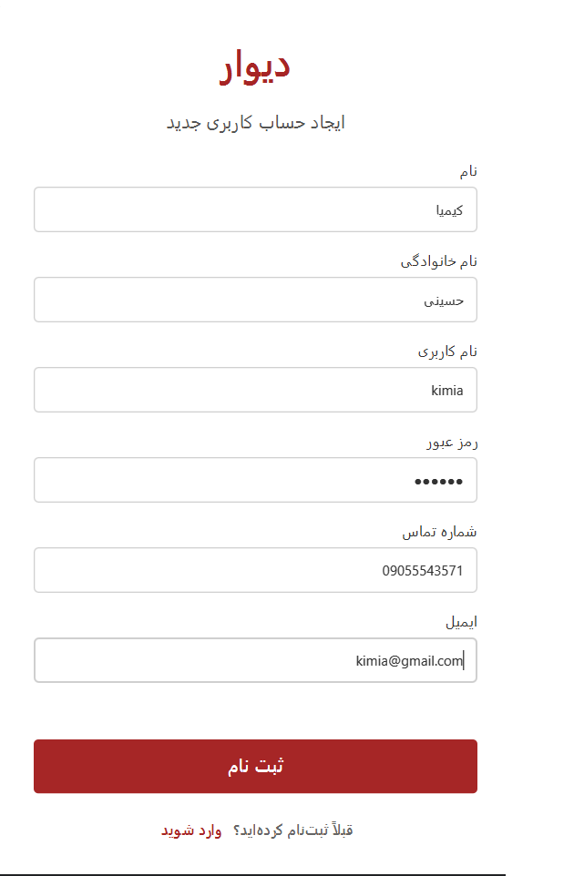 | 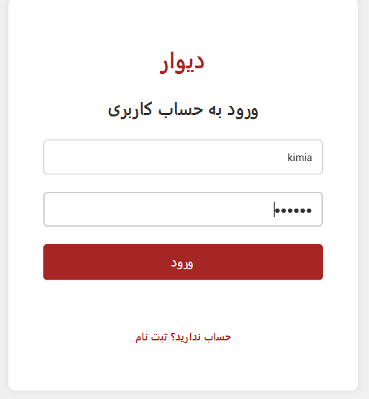 |

**صفحه‌ی اصلی و ثبت آگهی**

صفحه‌ی اصلی با لیست آگهی‌ها، جست‌وجو و فیلترها:

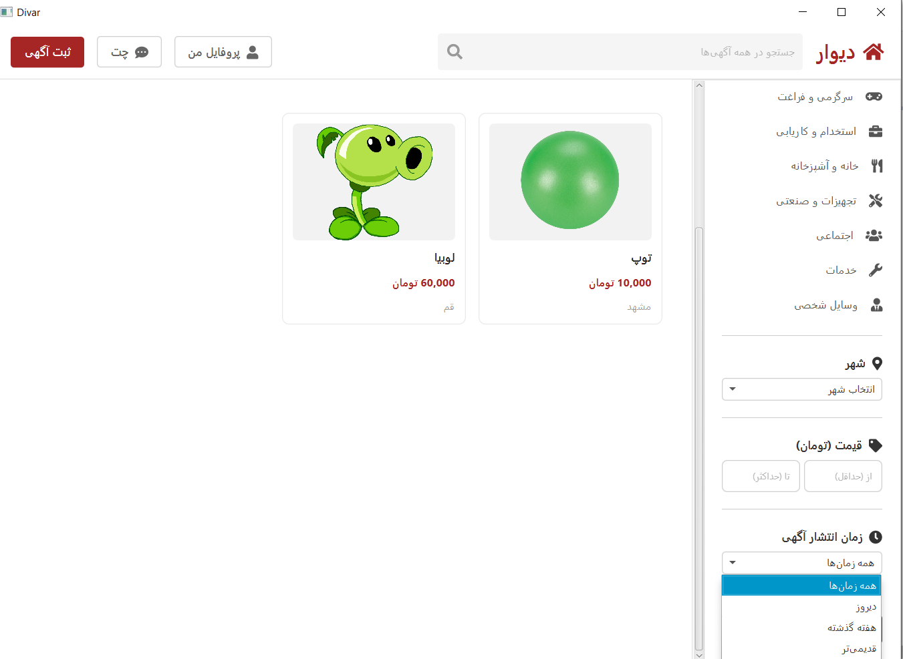

فرم ثبت مشخصات آگهی (شامل آپلود عکس) و مرحله‌ی تکمیل اطلاعات آگهی؛ پس از ثبت، آگهی در وضعیت «در انتظار بررسی مدیر» قرار می‌گیرد:

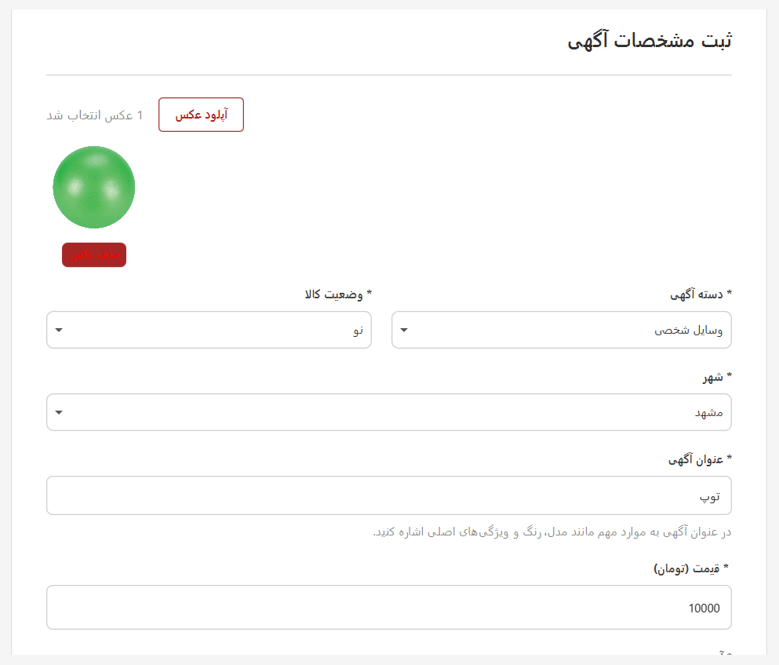
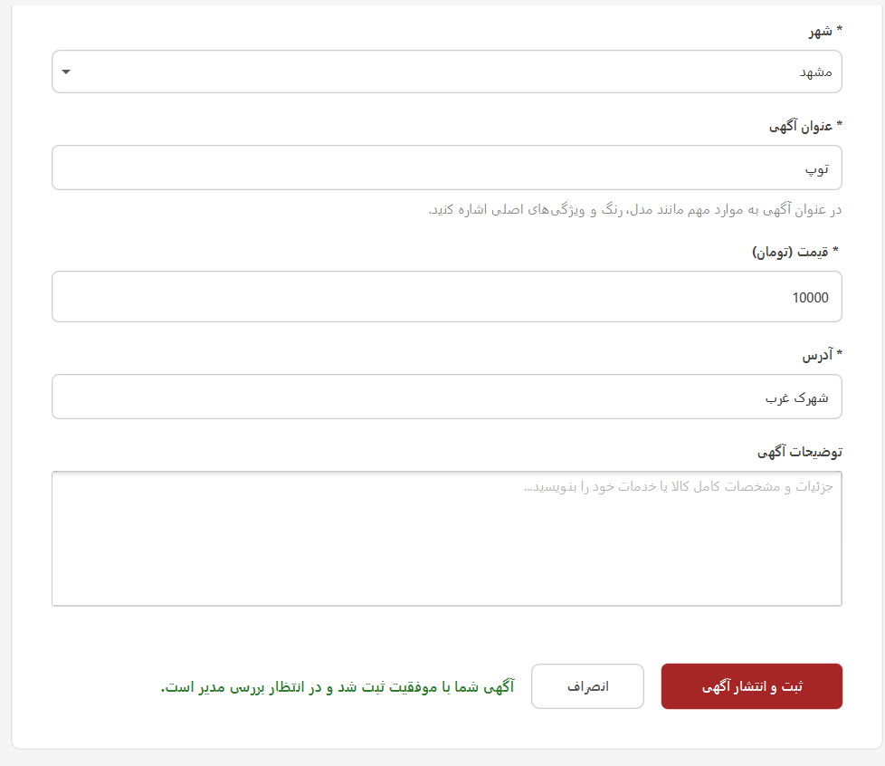

**جزئیات آگهی**

صفحه‌ی جزئیات آگهی با اطلاعات کامل (دسته‌بندی، قیمت، شهر، فروشنده و امتیاز او) و عملیات آگهی (چت با فروشنده، افزودن به علاقه‌مندی، امتیاز به فروشنده، گزارش آگهی):

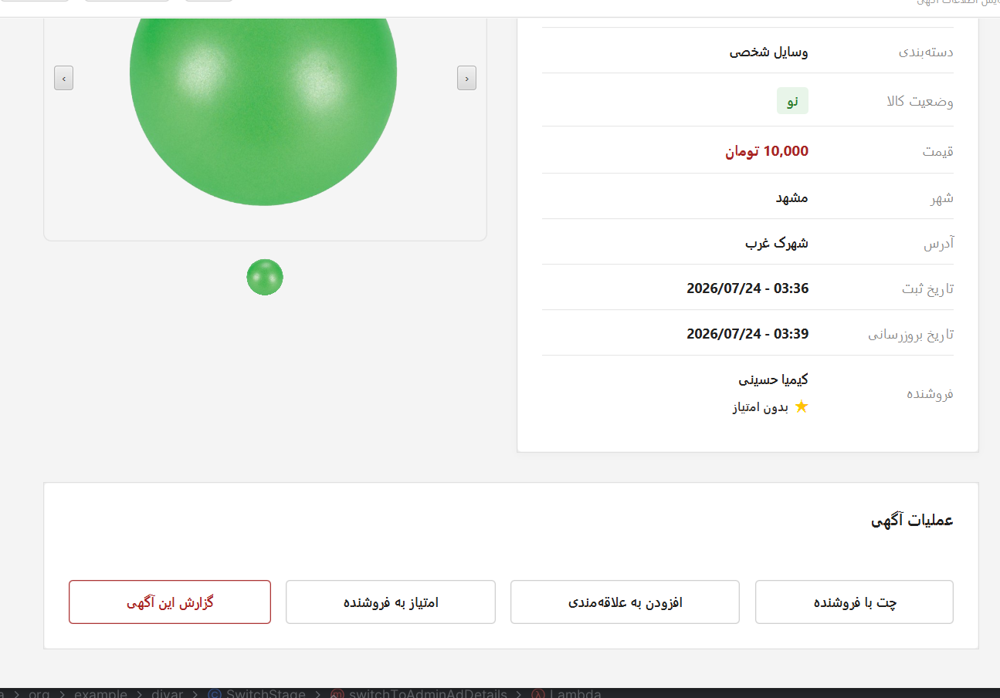

**چت آنلاین**

گفت‌وگوی real-time بین خریدار و فروشنده بر اساس آگهی، با لیست مکالمات کاربر:

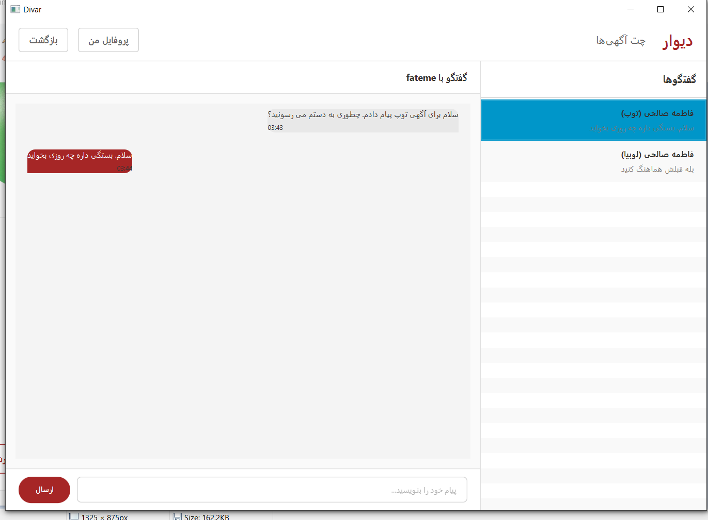

**امتیازدهی به فروشنده**

کاربر می‌تواند به فروشنده‌ی هر آگهی امتیاز (۱ تا ۵ ستاره) بدهد:

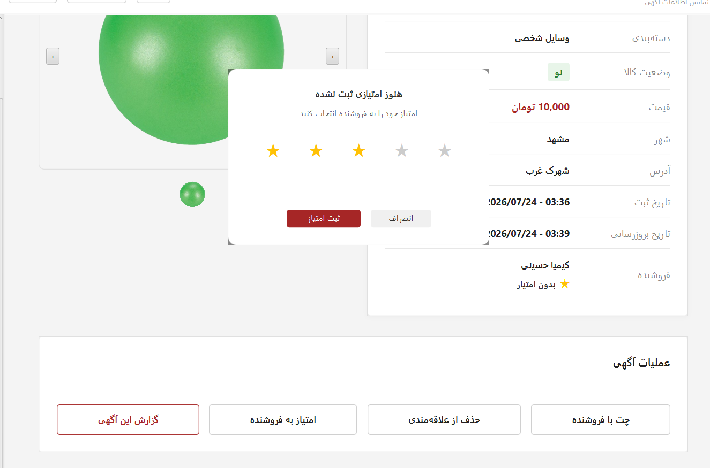

**گزارش و حذف آگهی**

گزارش یک آگهی با انتخاب دلیل (کلاهبرداری، دسته‌بندی اشتباه، قیمت اشتباه و ...):

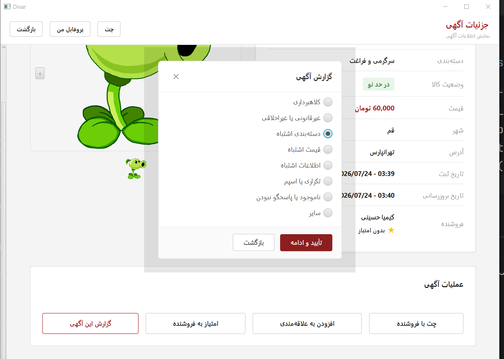

حذف آگهی توسط مالک آن:

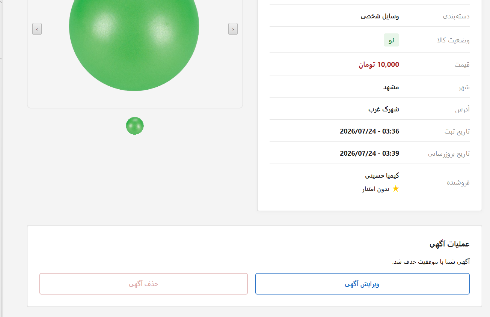

**پنل مدیریت (ادمین)**

داشبورد ادمین برای بررسی و تایید/رد آگهی‌های در انتظار تایید:

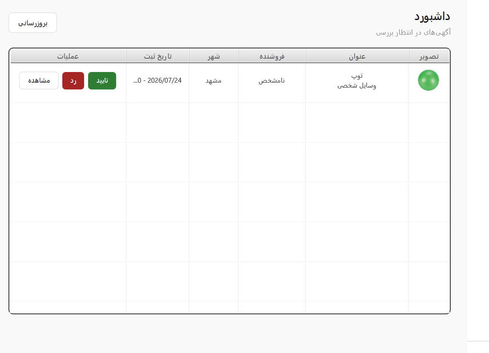

بخش گزارش‌ها برای رسیدگی به آگهی‌های گزارش‌شده توسط کاربران:

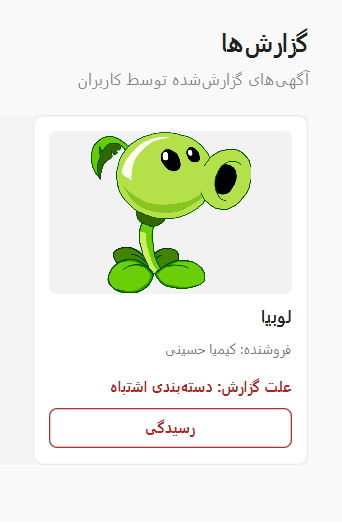

---

## شرح مسئولیت‌ها

### ۱. کیمیا حسینی‌نژاد (Backend Developer & Integration Lead)

- طراحی و پیاده‌سازی کامل بک‌اند پروژه با Java 21 و Spring Boot 3.3، شامل توسعه‌ی REST APIها، اتصال به PostgreSQL، استقرار (Deploy) سرور، و پیاده‌سازی قابلیت چت آنلاین (Real-time Chat) با WebSocket؛ همچنین تهیه و به‌روزرسانی مستندات API و در صورت نیاز آماده‌سازی ویدیوی راهنما برای هماهنگی بهتر با فرانت‌اند.
- تدوین ساختار کلی پروژه و ارائه‌ی راهنمایی فنی برای سازمان‌دهی بخش فرانت‌اند، به‌منظور هماهنگی بهتر بین دو سمت پروژه.
- پیاده‌سازی منطق کامل بخش چت؛ به‌طوری‌که در فرانت‌اند تنها طراحی ظاهری اجزا انجام شده بود و منطق ارتباطی و عملیاتی چت (اتصال WebSocket، ارسال/دریافت پیام، وضعیت خوانده‌شدن) توسط بک‌اند و در فرآیند integration تکمیل شد.
- مدیریت و پشتیبانی از Git و مخزن (Repository) پروژه، از جمله کمک به هم‌گروهی در حل مشکلات Git و رفع Conflictها در طول توسعه.
- آماده‌سازی مستند README نهایی پروژه.

### ۲. فاطمه صالحی مبین (Frontend Developer & Tester)

- پیاده‌سازی بخش عمده‌ی فرانت‌اند پروژه، شامل صفحات FXML و طراحی رابط کاربری، با هماهنگی و مشورت با بک‌اند دولوپر برای رعایت ساختار کلی سیستم.
- طراحی ظاهر صفحات و اجزای بصری، از جمله دکمه‌ها و چیدمان (Layout)ها، و مشارکت در آماده‌سازی ظاهر بخش چت.
- انجام تست‌های مکرر روی بخش‌های مختلف پروژه برای کشف خطاهای رفتاری، بررسی سناریوهای مختلف استفاده، و گزارش مشکلات به بک‌اند دولوپر.

